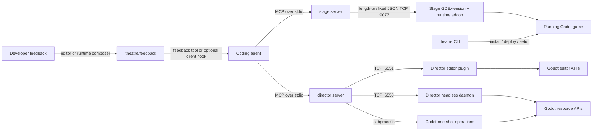

# Theatre Architecture

Theatre is a local Godot toolkit for coding agents and developers. It combines:

- **Stage**: observes and exercises a running Godot game.
- **Director**: reads and authors Godot scenes and resources through Godot's APIs.
- **Theatre CLI**: installs, deploys, enables, and configures the toolkit in a project.
- **Docs generation**: publishes MCP schemas and descriptions from the Rust tool routers.

The central boundary is the Godot process. Godot owns engine state and resource serialization; Rust owns typed transport, orchestration, analysis, and response shaping.

## System shape



The servers are separate from Godot. Stage's addon lives inside the running game;
Director's plugin lives inside the editor, while its headless backends are
separate Godot processes. The CLI is setup and distribution tooling, not a
runtime dependency of either MCP server.

## Ownership map

| Area | Owner | Durable responsibility |
|---|---|---|
| MCP tool registration and schemas | `crates/stage-server` and `crates/director` | Typed input boundaries, tool descriptions, MCP responses |
| Stage spatial reasoning | `crates/stage-core` | Bearings, indexes, deltas, watches, budgets, projection |
| Saved clip analysis | `crates/stage-server` | SQLite reads, temporal queries, visual artifact generation |
| Stage wire types and framing | `crates/stage-protocol` | Shared Stage TCP messages, handshake, query types, recording frame types, codec |
| Godot runtime observation | `crates/stage-godot` and `addons/stage` | Scene-tree access, engine queries, runtime actions, capture, lifecycle glue |
| Director Godot operations | `addons/director/ops` | Native scene/resource/project operations and structured operation results |
| Director backend routing | `crates/director` | Editor connection, daemon lifecycle, one-shot fallback, path and process resolution |
| Project installation and deployment | `crates/theatre-cli` | Installed share directory, addon copies, GDExtension placement, MCP config, plugin enablement |
| Human feedback evidence | `crates/theatre-feedback` and `addons/theatre_shared` | Shared typed readers, project-local publication, handling, and explicit deletion |
| Optional client notices | `client-plugins/claude` and `client-plugins/codex` | Thin client-native hooks around the Theatre CLI helper |
| Generated tool reference | `crates/theatre-docs-gen` and `site/api/` | Input and output schemas emitted from the routers |

The repository layout and crate dependency graph are defined by the workspace manifest in [`Cargo.toml`](../Cargo.toml). Stage deliberately keeps `stage-godot` dependent on `stage-protocol`, not `stage-core`; Director has no Stage runtime dependency.

## Stage: observe, reason, act

A live observation crosses the engine boundary before the server reasons about
its result:

```text
agent -> stage-server handler -> TCP query -> Godot engine access
agent <- shaped response <- server/core reasoning <- engine response
```

`stage-protocol` defines shared wire types and framing; it is not a separate
process. `stage-core` is an engine-independent library used by the server.

### Engine side

`StageRuntime` is a GDScript autoload. It instantiates the Rust GDExtension classes only after checking that the extension is available. This check is a deliberate degraded path: a project can load the addon without a platform binary, although Stage data is unavailable until the binary is deployed.

The extension owns three engine-facing roles:

- `StageCollector` reads the scene tree and engine properties during the physics callback.
- `StageTCPServer` listens on `127.0.0.1` (default port `9077`), performs the handshake, and dispatches requests on the Godot thread.
- `StageRecorder` maintains dashcam buffers and owns capture and clip persistence, including spatial frames and optional screenshots.

The Stage autoload also registers a native Logger for bounded diagnostics from the
current game process. It composes deliberate runtime feedback through the shared
addon support payload without depending on the recorder.

Observation collection does not change the game. `spatial_action` is the explicit exception: it can pause, advance, mutate nodes, invoke methods, emit signals, and inject input for debugging.

### Server side

The Stage server keeps session state for the TCP connection, handshake metadata, configuration, the spatial index, the delta baseline, watches, and the resolved clip-storage path. The handshake carries engine-owned project and run identity. When launched from a selected Godot project, the server verifies that identity before publishing its connection or sending project configuration. `stage-core` receives plain serialized data and performs the reasoning that does not require Godot APIs.

`runtime_status` distinguishes a connected transport from a ready current scene.
The engine run identifier survives client reconnects, while each connection has
its own session identifier. Disconnected status does not present old identity as
current.

A snapshot refreshes the server's spatial index and establishes the baseline used by a later delta. Queries such as nearest and radius use that index; raycasts and navigation requests still require an engine query. A disconnected or restarted game invalidates the live delta baseline, while the MCP process can reconnect and retain its in-memory watch/config intent.

Responses are shaped after the engine response: filters, detail tiers, budget limits, spatial calculations, and session metadata are applied before the MCP result is serialized. See [`crates/stage-server/src/mcp/`](../crates/stage-server/src/mcp/) and [`crates/stage-core/src/`](../crates/stage-core/src/).

## Director: native authoring through selectable backends

Director exposes one MCP operation surface, but its Godot execution can use three paths:

1. **Editor plugin**, contacted at `127.0.0.1:6551` by default when reachable.
2. **Headless daemon**, contacted at `127.0.0.1:6550` by default and supervised by the Rust server.
3. **Headless one-shot** Godot subprocess as the final fallback.

The Rust backend tries those paths in order. A shared dispatcher and scene-edit
context give individual and batch operations the same mutation implementation.
Open scenes use their actual editor roots and native undo history, without an
implicit save. An inactive named tab is activated for the correct history, then
the prior tab is restored. Detached file contexts serialize and save their roots.
For standalone execution, Director resolves Godot from `GODOT_BIN`, then
`GODOT_PATH`, then `godot` on `PATH`.

Mutating results distinguish written files from changed, unsaved scenes.
`scene_save` serializes only the selected scene and retains undo. It does not
flush unrelated edited external resources or clear Godot's native dirty marker.
Batch entries preserve sequential partial effects and failure data, not rollback.
Editor connections are verified against Godot's actual project root before
dispatch. Cached reuse also checks the requested canonical project and port.
An uncertain response after editor dispatch is not replayed on another backend.

Director's important boundary is serialization: `.tscn`, `.tres`, and other Godot resources are created or modified through Godot's `PackedScene`, `ResourceSaver`, `ClassDB`, and related APIs. Agents should use Director for those files rather than constructing their text representation. Reading and diffing serialized files is supported. Scripts, shader source, and ordinary text remain code-owned files and can be edited directly; `project_reload` provides a Godot-backed validation pass afterward.

`engine_api` queries the selected engine's ClassDB for focused authoring metadata.
`editor_run` uses a verified editor connection to start, stop, or restart a saved
scene without saving open work. Director reports native play state. Stage remains
the authority for runtime readiness and run identity.

Director operations return a normalized `success`/`data` or `success: false`/`error` shape internally. The MCP layer deserializes the data into typed output schemas. A `batch` is sequential and can stop at the first failure; it is not a transaction and does not provide rollback.

See [`crates/director/src/backend.rs`](../crates/director/src/backend.rs), [`addons/director/editor_ops.gd`](../addons/director/editor_ops.gd), and [`addons/director/operations.gd`](../addons/director/operations.gd).

## Capture and retained evidence

A dashcam is a rolling history kept before an interesting moment is marked.
The recorder keeps bounded spatial and screenshot buffers and saves capture
windows as per-clip SQLite files. Spatial entity frames use MessagePack;
screenshots use JPEG. Capture can remain active without an agent connection,
and projects can disable dashcam startup independently of on-demand observation.

Pixel readback stays on the Godot thread; encoding and capture-local change
measurement can use an owned-data worker. The recorder reports capture gaps
and health rather than treating dropped or unavailable images as unchanged
frames. Headless Godot can supply spatial data without a rendered viewport.

The runtime autoload registers a native Logger for current-process diagnostics.
Its bounded queue survives client reconnects, not game restarts. Worker-thread
callbacks retain bounded data under a mutex; the main-thread query supplies that
data with engine run identity. This is separate from editor log history and from
project validation in a headless subprocess.

The separate `viewport` query reads the latest completed root-viewport render on
explicit demand. Its native JPEG capture stays on the Godot thread and does not
use the recorder, an encoding queue, or a saved clip. Output dimensions are
bounded, but source readback can still delay the main thread. Engine run identity,
readback physics counter and render counter describe provenance, not an atomic
pixels-and-state snapshot.

The server reads saved clips for temporal queries and uses `temporal-vision`
for derived images such as storyboards and motion histories. Generated artifacts
are cached in the clip database. Their frame references and gap metadata let
callers distinguish sampled visual evidence from a complete continuous record.
These derived operations are not a replay or simulation of the game.

## Human feedback

The runtime and editor integrations can compose deliberate feedback from a
viewport, current selection or pointer context, and an optional note. The shared
`addons/theatre_shared` payload publishes each item as an immutable directory in
the selected project's `.theatre/feedback` storage. A temporary sibling directory
is renamed only after the metadata and optional JPEG are complete.

`crates/theatre-feedback` gives Stage, Director, and the Theatre CLI one typed
reader and management surface. Retrieval is non-destructive. Handling records a
shared annotation that suppresses pending notices, while explicit deletion removes
evidence. Reads work after the engine exits and do not require a live connection.
Incomplete publications remain visible for explicit cleanup.

Normal Stage and Director results can include a best-effort pending notice without
changing their success or error meaning. The optional Claude and Codex packages
invoke the same CLI helper after client tool calls and inject text notice context
only. They do not handle evidence, embed images as text, wake idle agents, or
provide asynchronous steering. Client installation, activation, and trust remain
explicit user actions.

## CLI and distribution

The `theatre` executable separates installation from project deployment:

- `install` builds and populates the user-level binaries, addon templates, GDExtension, and optional client packages.
- `init` copies selected addons and their shared support payload, generates `.mcp.json`, enables plugins, registers `StageRuntime` when selected, and can generate project agent rules.
- `deploy` rebuilds from the repository when run from a source checkout, updates the installed share directory, and copies the addon, shared support, and binary payload into one or more projects.
- `enable` changes plugin enablement without copying files.
- `rules` generates the project guidance that keeps scene/resource authoring on Director.
- `mcp` regenerates the MCP configuration.

Development projects may use tracked links for addon directories. Deployment verifies expected links before copying a GDExtension through them; unrelated links are not followed for writes. On native Windows, Git must materialize symlinks as symlinks for that workflow; otherwise use ordinary copied addons. The platform-aware CLI is the supported Windows deployment path.

## Stack and platform boundaries

Rust workspace manifests own language edition, crate versions, and dependency
features. The gdext dependency requires Rust 1.94 or newer. Tokio and rmcp serve
the asynchronous agent boundary; gdext 0.5.5 exposes Rust classes against the
Godot 4.7 API. GDScript owns editor-plugin lifecycle and Director's native
authoring operations. SQLite is recording storage, not an application server or
a shared project database.

The GDExtension API target and manifest minimum must remain aligned. Their
current settings are in [`stage-godot/Cargo.toml`](../crates/stage-godot/Cargo.toml)
and [`stage.gdextension`](../addons/stage/stage.gdextension). Lazy function-table
loading avoids eagerly validating unrelated Godot methods; actual exercised
engine behavior still needs compatibility verification.

CI configuration owns platform build and test targets. The release workflow
builds matched binaries and addon payloads; the site workflow generates and
publishes VitePress documentation from the tool routers. Exact matrices and
steps live in [`.github/workflows/`](../.github/workflows/), not a second prose
copy. Release ownership and authorized commands are in [`AGENTS.md`](../AGENTS.md).

## Thread and process rules

- Godot scene-tree and engine APIs are main-thread-only. Stage's `Gd<T>` values do not cross thread boundaries.
- Stage's runtime poll runs from the Godot physics lifecycle. Its socket handling is bounded and hands engine work to the same main-thread callback.
- Screenshot encoding may use a worker, but only plain pixel data crosses that boundary; Godot objects remain on the engine thread.
- Stage's MCP server uses Tokio for asynchronous MCP and TCP coordination. It registers pending responses, releases session locks before awaiting the addon, and applies a per-query timeout.
- Director's daemon is a supervised child process. Windows launches use the internal process supervisor so owned descendants are terminated with the parent; Unix launches use direct process management.
- MCP stdout is protocol output. Rust logs go to stderr. Director's headless GDScript stdout is its operation-result channel and is parsed separately by the Rust client.

## Serialization and wire boundaries

Stage and Director each use typed Rust boundaries for their controlled interfaces. Stage's server and GDExtension consume the shared `stage-protocol` definitions; MCP schemas are derived from the same parameter types used by handlers. The docs generator reads the routers rather than maintaining a second schema catalog.

Stage TCP frames are a four-byte big-endian payload length followed by UTF-8 JSON. The decoder rejects payloads larger than 16 MiB. Stage begins a connection with an addon handshake and a server acknowledgement; the current protocol version is defined in [`crates/stage-protocol/src/handshake.rs`](../crates/stage-protocol/src/handshake.rs). Director editor/daemon connections use the same framing utility but begin with an operation request rather than a Stage handshake.

## Security and operating boundary

Theatre is intended for local development, not untrusted network clients.
Stage binds its listener to loopback. Director's Rust clients connect through
loopback, but its GDScript editor and daemon listeners call `TCPServer.listen`
without an explicit bind address; they do not establish a loopback-only server
boundary. Neither protocol authenticates callers. Do not assume localhost client
configuration prevents other network access.

These are powerful development interfaces: Stage can invoke node methods and
Director can write project resources. Keep them off untrusted networks and do
not expose them as a production-game service without an appropriate security
boundary.

## Verification boundary

The test strategy follows the architecture:

1. Pure unit tests cover `stage-core`, protocol serialization/framing, and handler validation.
2. Rust integration tests exercise server behavior against controlled transports and operation results.
3. Godot-backed journeys exercise the runtime addon, daemon/one-shot operations,
   resource serialization, and running-game loop. File-operation editor mocks
   remain distinct from graphical EditorInterface journeys, which exercise native
   undo shortcuts, multiple dirty tabs, selected saving and reopened content.
4. Documentation checks validate links, generated references, and claims against source; they do not substitute for runtime verification.

The complete verification commands and environment requirements belong to [`.work/CONVENTIONS.md`](../.work/CONVENTIONS.md), not this foundation.

## Source index

- Stage runtime entry: [`addons/stage/runtime.gd`](../addons/stage/runtime.gd)
- Stage server: [`crates/stage-server/src/`](../crates/stage-server/src/)
- Stage GDExtension: [`crates/stage-godot/src/`](../crates/stage-godot/src/)
- Shared protocol: [`crates/stage-protocol/src/`](../crates/stage-protocol/src/)
- Director server and operations: [`crates/director/src/`](../crates/director/src/) and [`addons/director/ops/`](../addons/director/ops/)
- CLI: [`crates/theatre-cli/src/`](../crates/theatre-cli/src/)
- Generated Stage API: [`site/api/index.md`](../site/api/index.md)
- Generated Director API: [`site/api/director.md`](../site/api/director.md)
- Engineering principles: [`PRINCIPLES.md`](PRINCIPLES.md)
